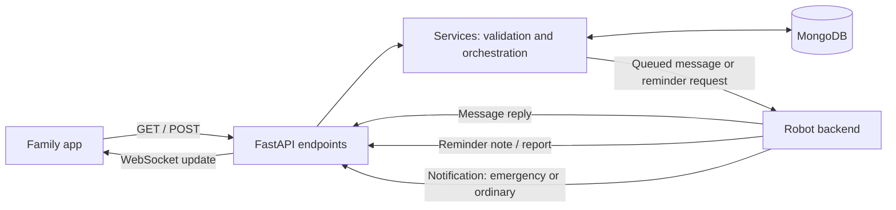

# Annie app backend — replacement contract

**Status: implemented, MongoDB-backed v2.** The previous backend is archived in
ignored `tmp/app_backend_legacy/` and `tmp/backend_archives/`; its old setup is in
[LEGACY_README.md](LEGACY_README.md). The new API deliberately replaces the legacy
routes. **The Swift app_frontend adapter is implemented; robot_backend still needs its v2 adapter.**

## Start here

```sh
cd app_backend
python3 -m venv .venv
.venv/bin/python -m pip install -r requirements.txt
# Copy .env.example to .env only if .env does not already exist; enter MONGODB_URI.
.venv/bin/python tools/check_database.py
.venv/bin/python -m uvicorn app.main:app --host 0.0.0.0 --port 8000 --workers 1 --no-proxy-headers
```

`app_backend/.env` is loaded automatically regardless of the current working
directory. Use MongoDB Atlas or a replica set; a standalone MongoDB server cannot
provide the transactions required for record/dispatch/idempotency atomicity.
Startup creates indexes and seeds empty collections in `MONGODB_DB` (default
`annie_v2`). It fails explicitly if MongoDB is missing or unavailable; no in-memory
fallback exists. Existing populated collections are not overwritten.

Open `/docs` for interactive endpoint documentation and `/openapi.json` for the
contract. `/health` checks process liveness; `/ready` checks MongoDB availability.
On a phone, use the Mac's LAN IP. No family API token or host-list environment
setting is required. The API is for a trusted local demo, not public exposure.

Quick check from a terminal (substitute the reachable server address):

```sh
curl 'http://127.0.0.1:8000/api/reminders?app_user_id=2'
curl -X POST http://127.0.0.1:8000/api/reminders \
  -H 'Content-Type: application/json' -H 'Idempotency-Key: add-water-1' \
  -d '{"app_user_id":2,"daily_time":"16:45","description":"Drink water"}'
```

Zach is app user `2`; Ellis is `3`; Jeanine is dog user `1`. Both family members
see the new reminder. List responses use `{items, next_cursor}`; conversations
use `{id, app_user_id, dog_user_id, day, messages, next_cursor}`. The absent-day
conversation has `id=null` and `messages=[]` without creating a database record.

## Responsibility and flow

The app backend stores household users, daily conversations, recurring reminders,
reminder reports, and notifications. It schedules reminder requests and relays
family messages to the robot backend. The robot backend owns perception, speech,
resident interaction, and execution; the app backend performs no inference.



Zach and Ellis each belong to Jeanine's household. They share Jeanine's reminders,
notes, and notifications. Each has a separate daily conversation with Annie.
An emergency flag means the robot reported an urgent event, not a diagnosis.

## Confirmed scope

1. The reviewed contract is implemented here; frontend and robot adaptation follow.
2. Jeanine uses `America/New_York`; each dog user has a configurable IANA timezone.
3. Every new family message automatically creates a robot request; each app user
   has a separate daily conversation.
4. Reminders belong to the dog user, not their creator. Every family member of
   that dog user sees the same list, including reminders added by another member.

5. Reminder clock time is `daily_time`; notifications use only `is_emergency`.
6. Record IDs and foreign keys are integers allocated by the backend.

The implementation follows these defaults. Existing MongoDB collections are not
migrated; use the new database. Frontend and robot integration remain separate.

## Small implementation structure

```text
app_backend/
  README.md
  .env.example
  requirements.txt
  app/
    main.py              # FastAPI lifespan, routers, error handling
    config.py            # typed settings; loads app_backend/.env
    database.py          # one async PyMongo client, indexes, startup ping
    seed.py              # initialize empty collections
    schemas/             # Pydantic request, response, and document models
      users.py
      reminders.py
      messages.py
      notifications.py
    services/            # business rules and MongoDB get/create/update calls
      users.py
      reminders.py
      messages.py
      notifications.py
      robot.py           # bounded HTTP dispatch and callback correlation
    api/                 # thin routers calling services
      users.py
      reminders.py
      messages.py
      notifications.py
      robot_callbacks.py
      websocket.py
    scheduler.py         # one worker, durable reminder occurrences/retries
  tests/
```

Flow: **schema validation → endpoint → service → MongoDB/robot transport**.
Keep models out of endpoints and database queries out of routers. Use PyMongo's
async client directly; no ORM, Redis, Celery, or second database is required.
MongoDB is required: missing/unreachable configuration fails readiness/startup
with a safe error. Do not silently switch to memory and lose writes.

## Data conventions

- Public record IDs and foreign keys are positive integers, serialized as JSON
  numbers. MongoDB allocates them using atomic `$inc` counters, never `count + 1`.
  IDs are globally unique across records (including conversation entries and
  dispatches), bounded by JavaScript's safe integer maximum. Gaps are fine;
  deleted IDs are never reused. MongoDB `_id` remains an internal implementation
  detail. Initialize the counter above the largest seed ID before accepting writes.
- `timestamp` and all event times are UTC ISO 8601 values with timezone.
- `day` is `YYYY-MM-DD` in the associated dog user's timezone.
- `daily_time` is local `HH:MM`, including minutes such as `09:30`.
- Validate references in services: no orphan app users, reminders, or notes.
- Daily conversations have a unique compound index `(app_user_id, day)`.
- The backend assigns record IDs; clients do not invent them. Creation and robot
  callback POSTs carry an `Idempotency-Key` header, an opaque string reused for
  retries. This is a retry key, not a record ID. Store the key and payload hash
  atomically with the mutation; identical retries return the original numeric ID,
  and reuse with different content returns 409. Scope keys by operation and sender.
- GET lists are bounded and cursor-paginated (default 50, maximum 100).
- Do not return MongoDB `_id`, credentials, raw provider responses, or media.

## Six business collections

| Collection | Fields | Relationships / indexes |
|---|---|---|
| `dog_users` | `id`, `name`, `timezone`, `timestamp` | Unique `id`; one resident per record |
| `app_users` | `id`, `name`, `dog_user_id`, `timestamp` | Unique `id`; index `dog_user_id`; many family members per resident |
| `reminders` | `id`, `dog_user_id`, `daily_time`, `timestamp`, `description`, `enabled` | Unique `id`; index `(dog_user_id, daily_time)` |
| `notes` | `id`, `reminder_id`, `dog_user_id`, `occurrence_id`, `timestamp`, `description`, `outcome`, `source` | Unique `id`; indexes `(reminder_id, timestamp)` and `(dog_user_id, timestamp)` |
| `messages` | `id`, `app_user_id`, `dog_user_id`, `day`, `messages[]` | Unique `id`; unique `(app_user_id, day)` |
| `notifications` | `id`, `dog_user_id`, `timestamp`, `description`, `is_emergency`, `source` | Unique `id`; index `(dog_user_id, timestamp)` |

`notifications` is the requested emergencies table plus ordinary robot-triggered
notifications. There is no second emergency collection containing duplicates.
Use only `is_emergency: bool`: true for emergencies, false for ordinary updates.
A separate notification `type` would duplicate that information, so omit it.

A conversation entry contains `id`, `role` (`app_user`, `robot`, `resident`),
`text`, `timestamp`, `request_id`, optional `reply_to`, and `status` for outgoing
requests (`queued`, `accepted`, `completed`, `failed`). A daily document is
created on the first message, not by an empty GET. Missing days return an empty
conversation. Enforce an 8 MiB daily document limit below MongoDB's document limit;
reject further appends explicitly rather than silently truncating history.

A note has `outcome`: `completed`, `not_completed`, or `unknown`. Reports are
append-only: multiple updates may belong to one reminder occurrence. A reminder's
`done` is computed for a requested day from its latest occurrence report, not
stored as a permanent property of the recurring reminder. `latest_note` is
included in reminder responses for the frontend's last-activity display, even
when it belongs to an earlier day. Completion is false before the requested
day's `daily_time` in the resident's timezone, even if a completed report exists.
The current list defaults to today; yesterday's completion never carries over.

## Initialization and seed data

Create indexes, then seed **only collections that are absent or empty**. Do not
reset populated collections or overwrite edits on restart. Seed parent collections
before children, use deterministic IDs/upserts, and validate that Jeanine exists
before adding seed children. A nonempty household with no Jeanine is not modified
with dangling references. Seed checks and writes are a single transaction, so an interrupted seed rolls
back completely. A seed marker prevents re-creating records deliberately deleted
after the initial successful initialization.

| Collection | Seed |
|---|---|
| `dog_users` | `id=1`, `name=Jeanine`, timezone `America/New_York` |
| `app_users` | `id=2`, `name=Zach`, `dog_user_id=1`; `id=3`, `name=Ellis`, same resident |
| `reminders` | Five rows below, all `dog_user_id=1`, enabled, timestamp set at seeding |
| `messages` | Empty until a user posts |
| `notifications` | Empty; no fabricated emergency |
| `notes` | Two explicitly marked `source=seed` completion reports for the initial seed day, only for the freshly seeded reminders |

| ID | Daily time | Description | Initial seed-day done |
|---|---|---|---|
| `4` | 08:00 | Take morning medication | true |
| `5` | 09:30 | Morning walk with Annie | true |
| `6` | 12:30 | Take midday medication | false |
| `7` | 15:00 | Charge your phone | false |
| `8` | 18:00 | Take evening medication | false |

The two seed notes are synthetic examples, not robot observations. They use the
actual seeding timestamp and must never be presented as real medication evidence.
On subsequent days all reminders start without completion reports. Seed records
must not cause real robot dispatch merely because the server starts.

## Family endpoints

| Method / path | Input and result |
|---|---|
| `GET /health` | Process liveness |
| `GET /ready` | MongoDB readiness; 503 if unavailable |
| `GET /api/dog-users` | List residents |
| `POST /api/dog-users` | `{name, timezone}` → resident |
| `GET /api/app-users?dog_user_id=1` | Family members |
| `POST /api/app-users` | `{name, dog_user_id}` → member |
| `GET /api/reminders?app_user_id=2&day=2026-09-20` | Resolve Zach → Jeanine; reminders with `done` and `latest_note`; day defaults to today |
| `POST /api/reminders` | `{app_user_id, daily_time, description}`; resolve resident server-side; 201 |
| `GET /api/messages?app_user_id=2&day=2026-09-20` | One daily conversation, oldest-first entries; omit day for today |
| `POST /api/messages` | `{app_user_id, text}`; timestamp/day assigned by server; persist then queue robot request; 202 |
| `GET /api/notes?app_user_id=2&reminder_id=4` | Household-scoped reports; reminder filter optional; newest first |
| `GET /api/notifications?app_user_id=2&is_emergency=true` | Household-scoped notifications; emergency filter optional |
| `GET /api/history?app_user_id=2` | Combined notes and notifications, newest first, stable `(timestamp,id)` cursor |
| `GET /api/requests/{request_id}?app_user_id=2` | Dispatch status and safe failure reason; validate household/conversation ownership |
| `WS /ws?app_user_id=2` | New message entries, shared reminder changes, note updates, notifications, and dispatch status |

Posting reminders through `app_user_id` avoids trusting a conflicting resident ID.
The service saves the reminder under that app user's `dog_user_id`, then publishes
`reminder.created` to **all** connected app users belonging to that dog user.
For example, Zach adds "Charge your phone": both Zach and Ellis immediately see
it in their shared list. Creator identity never filters visibility. Disconnected
clients see it on their next GET or reconnect. Any future edit/delete endpoints
must preserve the same household-wide visibility and broadcast behavior.
Conversation events are scoped to the conversation's app user; reminder/note/
notification events are scoped to every app user of the resident.
Robot reports reference the reminder/request, from which the service derives the
household. Unknown IDs return 404; invalid bodies 422; conflicts 409; unavailable
persistence 503. No POST succeeds before its record is durably stored.

History items share `id`, `kind` (`note` or `notification`), `timestamp`,
`dog_user_id`, `description`, `is_emergency`, and optional `reminder_id`/`outcome`.
History is a merged read of notes and notifications, not another collection.
Family identities are selected demo IDs, not proof of authentication. Preserve
the requested token-free local-network demo; public deployment/login is separate.

## Robot contract: three flows

### 1. Scheduled reminder → reminder report

At a reminder's daily due time, app_backend creates a durable occurrence and sends
`POST {ROBOT_BACKEND_URL}/api/reminder-requests`:

```json
{"request_id":100, "occurrence_id":100, "dog_user_id":1, "reminder_id":4, "day":"2026-09-20", "daily_time":"08:00", "scheduled_at":"2026-09-20T12:00:00Z", "description":"Take morning medication"}
```

Robot returns 202 with `{request_id, status: "accepted"}`. Acceptance does not
mean spoken or completed. Robot later calls **`POST /api/notes`** with a stable `Idempotency-Key` header:

```json
{"request_id":100, "occurrence_id":100, "reminder_id":4, "timestamp":"2026-09-20T12:02:00Z", "description":"Resident confirmed completion.", "outcome":"completed"}
```

Persist the report, update occurrence status, then publish the family update.
Multiple reminders produce individually correlated notes; a later batch endpoint
can wrap the same records without losing reminder identity.

### 2. App message → robot interaction → conversation reply

`POST /api/messages` saves the family entry and returns 202 immediately with
`conversation_id`, `message_id`, `request_id`, `day`, and `status=queued`.
A worker sends `POST {ROBOT_BACKEND_URL}/api/message-requests`:

```json
{"request_id":100, "conversation_id":101, "message_id":102, "app_user_id":2, "dog_user_id":1, "day":"2026-09-20", "text":"Please ask Jeanine how she is feeling."}
```

The robot accepts with 202 and later calls **`POST /api/messages/replies`**
with a stable `Idempotency-Key` header:

```json
{"request_id":100, "reply_to":102, "role":"resident", "text":"I am doing well.", "timestamp":"2026-09-20T12:05:00Z", "final":true}
```

The request determines the original user/day; callbacks cannot redirect a reply
into another family's conversation. A reply after midnight stays in the original
conversation. Robot summaries use `role=robot`; both may be appended. Duplicated
callbacks must not duplicate entries. Final callbacks complete the request.

### 3. Robot-triggered notification

Robot calls **`POST /api/notifications`** with a stable `Idempotency-Key` header:

```json
{"dog_user_id":1, "timestamp":"2026-09-20T12:10:00Z", "description":"Jeanine requested family assistance.", "is_emergency":true}
```

Persist once with `is_emergency=true`, then publish to all connected family members
for Jeanine. Ordinary updates use `is_emergency=false`. No message or reminder is required.
All three callback endpoints require the separate `X-Internal-Secret`; family
client token removal does not remove robot-callback authentication.

## Scheduling and delivery defaults

A technical `counters` document allocates globally unique numeric IDs atomically.
A small technical `dispatches` collection stores pending requests and reminder
occurrences; it is infrastructure, not a seventh business table. Index unique
`request_id` and unique reminder `(reminder_id, day)`. The occurrence ID is its dispatch request ID. Persist that allocated numeric
ID before sending, and use idempotent robot acceptance to prevent duplicate execution after a crash.
Persist outgoing message/reminder records and dispatch intent recoverably; use
atomic state updates and reconciliation before marking an item dispatched.

Run one scheduler worker, check every 15 seconds, and use finite HTTP timeouts.
Retry network failures and 5xx with bounded backoff using the same request ID;
4xx fails visibly. Policy: recover reminders at most 15 minutes late;
older occurrences are marked missed, never replayed in bulk. Creating a reminder
after its due time starts tomorrow. Seeded reminders become eligible tomorrow; they do not dispatch on the seed day. Spring DST missing times run at the next valid local minute;
fall DST repeats run once. Midnight and restarts must not duplicate reminders.

Do not retry accepted physical work blindly when its final report is late: show
awaiting-report status and reconcile using the same request ID. WebSockets carry
`event_id`, `type`, `timestamp`, and the saved record ID/data. Publish only after
persistence. On reconnect the frontend re-fetches the shared reminders, today's conversation, and history;
MongoDB is authoritative, and missed socket events do not lose records.

## Environment

```dotenv
MONGODB_URI=
MONGODB_DB=annie_v2
ROBOT_BACKEND_URL=http://127.0.0.1:8080
INTERNAL_SECRET=
ROBOT_DISPATCH_ENABLED=false
REMINDER_SCHEDULER_ENABLED=false
```

The user supplies `MONGODB_URI` in ignored `app_backend/.env`. Use a fresh database
name so existing MongoDB collections remain untouched. URI values are never logged.
Both dispatch and scheduling start disabled until the robot implements this
contract. Enable ROBOT_DISPATCH_ENABLED for queued messages and
REMINDER_SCHEDULER_ENABLED for daily reminders. Configure the same INTERNAL_SECRET
on both services first. Queued reminders expire after 15 minutes instead of being
replayed on late enablement. These flags avoid executing seed/demo requests.
No `ANNIE_API_TOKEN` or `ANNIE_ALLOWED_HOSTS` setup is required for the local demo.

```sh
cd app_backend
.venv/bin/python -m uvicorn app.main:app --host 0.0.0.0 --port 8000 --workers 1 --no-proxy-headers
```

## Delivery and integration

- Implemented: schemas, services, routers, transaction-backed writes, seed data,
  dispatch queue/retries, daily scheduling, callbacks, and WebSocket fan-out.
- Archived: full pre-replacement backend (including local edits) privately under
  `tmp/backend_archives/20260920-074759/`; source snapshot in `tmp/app_backend_legacy/`.
- Implemented: app_frontend v2 models/query IDs/pagination/socket updates and today-only chat.
- Pending: robot_backend request handlers plus authenticated callbacks. No legacy aliases
  hide the breaking changes. Existing simulator/family `/dispatch` demos belong
  to the archived contract and require adapters to use this service.
- Real robot execution has not been tested; all dispatch tests use fake HTTP.

## Verification

Install `requirements-dev.txt` for tests. `requirements.lock` records the full
verified dependency resolution, including test packages. Tests use **only**
isolated `annie_test_*` databases on localhost port 27029; they never read the
configured MongoDB URI. Start an isolated test server in another terminal:

```sh
mkdir -p /tmp/annie-v2-mongo-test
mongod --dbpath /tmp/annie-v2-mongo-test --port 27029 --bind_ip 127.0.0.1 --replSet annieTest
```

Then, from `app_backend`:

```sh
.venv/bin/python -m pip install -r requirements-dev.txt
.venv/bin/python tools/init_test_mongo.py
.venv/bin/python -m pytest tests -q
.venv/bin/python tools/export_schemas.py --check
```

Exported v2 document schemas and OpenAPI live in `app_backend/contract/`.
`tools/check_database.py` performs a read-only connection check against `.env`;
`tools/initialize_database.py` explicitly creates indexes and seed data (also done
at startup). Neither prints credentials or underlying provider error details.
MongoDB transactions are used as documented in the
[PyMongo transaction guide](https://www.mongodb.com/docs/languages/python/pymongo-driver/current/crud/transactions/).

Acceptance includes: Zach/Ellis share Jeanine reminders, including new reminders added by either
member, with live updates and reconnect recovery; separate daily chats;
09:30 precision; old-day lookback; replies after midnight; completion resets daily;
duplicate requests/reports are harmless; history merges notes and emergencies;
MongoDB outage never yields fake successful writes; restart never duplicates
physical dispatch; seed runs do not overwrite existing collections.

Uvicorn WebSocket transport is supplied by the pinned `websockets` dependency.
After installing dependencies into an already-running server environment, restart
Uvicorn so it detects that transport. The regression suite includes a real TCP
Uvicorn WebSocket upgrade and household update test.

## Companion voice adapter

The top-level robot_backend implements `/api/message-requests` and
`/api/reminder-requests`, authenticated with `X-Internal-Secret` matching
`INTERNAL_SECRET` in both services. Configure reciprocal backend URLs:
`ROBOT_BACKEND_URL` on app_backend and `COMPANION_BACKEND_URL` on robot_backend.
One audio phone serves `COMPANION_DOG_USER_ID` (Jeanine, 1 by default).

Accepted tasks start voice sessions on the connected foreground speaker_mic app.
Final robot summaries return to `/api/messages/replies`; reminder reports go to
`/api/notes`. These are summaries, not verbatim resident transcripts. Only a
confirmed completed reminder task produces outcome=completed; other outcomes
remain unknown. No physical navigation or background delivery is performed.

A SQLite ledger beside the existing outbox persists correlation IDs, request
fingerprints and final callbacks. Retries do not repeat accepted tasks and use
stable callback idempotency keys. Run one robot worker. In-memory conversations
cannot survive restart: unfinished requests return an inconclusive outcome instead
of being replayed. A disconnected phone waits until the session timeout and then
returns an unconfirmed outcome. Callback outages retry with bounded backoff.

Enable ROBOT_DISPATCH_ENABLED and REMINDER_SCHEDULER_ENABLED in app_backend for
operation, then restart both services. Enabling dispatch also sends previously
queued family messages; expired reminders are not replayed. Mocked regression
checks cover duplicate requests, callback retry and restart recovery. Physical
speech and the live provider round trip still require an on-device check.
