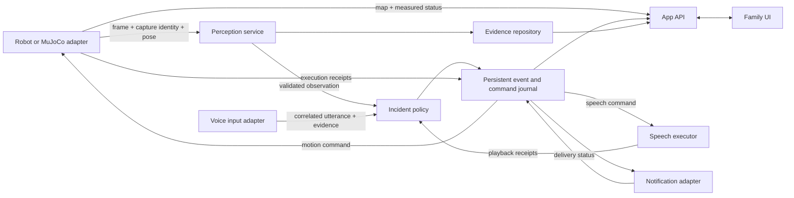

# Annie component responsibilities and engineering contract

Status: target architecture specified on 2026-09-19. This document describes
what the implementation must converge on; it is not a completion report.
The accompanying [acceptance specification](ACCEPTANCE.md) defines release gates.
Existing wire formats remain in [contract v0.1](../robot/contract/README.md) until a
coordinated, tested migration changes them.

## 1. Architectural objective

One reliable workflow: observe a possible concern, ask the resident, preserve
the evidence and uncertainty, bring it to family attention when appropriate,
and deliver a family response. Each action must have an owner and observable
outcome. A component failure must neither fabricate success nor erase concern.

Keep the current service count small. HTTP, SQLite, and ordinary Python modules
are sufficient for the simulation milestone. Redis, a graph database, another
agent framework, and additional microservices are not prerequisites. Add one
only when a measured requirement cannot be met cleanly by the existing design.

## 2. Owners and authority

| Area | Accountable owner | What it does | What it must not own |
| --- | --- | --- | --- |
| `robot/`, physical connection, simulation execution | Henry | Captures synchronized camera/pose; reports robot capability and health; executes bounded motion; owns stop behavior and model fidelity. | Resident incident decisions, family notification policy, fabricated perception. |
| `robot/simulation/` | Henry, with the affected component owner reviewing adapters | Builds repeatable synthetic scenes; steps physics; renders camera frames; exposes simulation controls and measurements. | A second production incident engine; hidden scene labels passed into inference. |
| `robot/robot_backend/` | Roger | Validates media; runs perception/STT; synthesizes and plays speech through selected adapters; reports honest outcomes; routes validated results. | Directly escalating family alerts from model prose or independently deciding that a resident is safe. |
| `robot/app_backend/` | Ellis | Owns the sole incident state machine, event/command journal, acknowledgments, evidence retrieval, application API, and notification delivery records. | Robot joint control, image inference, speech-provider implementation, browser layout. |
| `robot/frontend/` and family UI integration | Sam | Presents current/stale/unknown state, evidence, alerts, acknowledgment, command progress, and accessible family controls. | Synthesizing incidents, inventing fallback live data, selecting providers, storing secrets. |
| `robot/contract/` | Ellis coordinates; every changed producer/consumer owner reviews | Owns field semantics, compatibility, generated schemas, and examples. | A parallel incompatible model definition for each service. |
| Release integration | Henry coordinates; each owner signs their gate | Freezes the demo profile and gathers one evidence bundle across components. | Declaring another component passed from a screenshot or an HTTP 200. |

These are responsibility boundaries, not a demand to create more services.
Moving policy out of `robot/app_backend/` requires an explicit migration; never run
old and new policy engines against the same stream during the transition.

## 3. Data and action flow



The diagram is logical. Policy, journal, and API can remain in one process.
Family acknowledgment records that someone saw an alert. It does not resolve
the resident's condition. A command receipt reports execution evidence; it is
not a new user command. Model output is data, never executable authority.

## 4. Module boundaries inside the existing folders

The names below describe responsibilities. Reuse an existing suitable module
instead of adding duplicate classes or empty scaffolds just to match this table.

| Boundary | Inputs and outputs | Rules |
| --- | --- | --- |
| Domain types | Observations, incidents, commands, receipts, evidence references | Typed, versioned, finite values, explicit units, bounded text; independent of HTTP/provider SDKs. |
| Incident policy | Validated domain inputs + injected clock → state transitions and requested effects | Deterministic; no HTTP, SQL, model calls, filesystem, browser, or sleeping inside transition logic. |
| Application coordinator | Loads state, applies policy, commits state/effects, dispatches work | Owns transaction boundaries and correlation, not model prompts or rendering. |
| Repository | Durable incident state, events, command/outbox entries, observations | Persistence rules and migrations; parameterized queries; no incident thresholds in SQL helpers. |
| App transport | REST/WS validation, authentication, serialization | Thin routes calling application operations; no duplicate policy logic in endpoint handlers. |
| Robot adapter | Capture, status, map, bounded commands and receipts | Simulator and hardware implementations share semantics; no silent hardware fallback. |
| Perception adapter | Image + immutable capture metadata → typed observation or typed failure | Model-specific request/response parsing isolated here; never rewrite capture time to make a result fresh. |
| Audio input adapter | Audio + utterance/capture identity → transcript and available quality evidence | Distinguishes no speech, unintelligible speech, unsupported media, transport error, and usable transcript. |
| Reply interpreter | Transcript + active check-in + audio context → help/reassurance/ambiguous | Small explicit policy; negation and echo tests; no fabricated numeric confidence. |
| Speech executor | Identified text command → synthesis/start/end/failure receipts | Playback acknowledgments come from the actual player; only the selected output plays a command. |
| Notification adapter | Identified alert delivery request → acceptance/delivery/failure | Stable idempotency key; provider status mapped explicitly; no alerts from advisory agents. |
| Simulation engine | Scene/config, controller targets → measured state and renders | MuJoCo work on its required thread; network/render/UI failures isolated from policy. |
| Simulation HTTP/viewer | Bounded controls and read-only telemetry | Delegates physics, speech, navigation, and media work to their owners; no growing all-purpose request handler. |
| Family API client/store/views | Domain snapshots/events → display and deliberate requests | One API client and state reconciliation path; presentation never becomes the source of live truth. |

`Service` can be a useful coordinator. It becomes a maintenance problem when
transport, persistence, policy, and provider code cannot be tested or changed
independently. Extract at those seams as behavior is added. File length alone
is not the acceptance criterion; independent responsibilities and testability are.

## 5. Dependency direction and packaging

Required direction:

```text
transport / adapters / UI -> application operations -> domain types and policy
                                   |
                          persistence/provider ports
                                   |
                          concrete implementations
```

Concrete implementations are selected once at startup. Domain policy does not
import FastAPI, browser APIs, cloud clients, MuJoCo, or environment variables.
There must be no circular imports and no cross-service imports of mutable
application state. Sharing immutable contract definitions is appropriate.

The brain currently imports `robot.app_backend.app.models.Perception`. Before claiming
independent deployment, either package that contract dependency explicitly or
move the shared immutable models to one small installable contract module and
update both services together. Do not copy the class into each service.
Generated schema files are checked outputs, not separately edited sources.

No blanket rewrite is required. Preferred migration sequence:

1. Capture the existing behavior in meaningful robot/contract/policy tests.
2. Extract policy and time handling without changing endpoint behavior.
3. Extract persistence and implement transactional state/effect recording.
4. Isolate robot, vision, audio, and notification implementations.
5. Thin the viewer routes and separate UI state/network/render responsibilities.
6. Remove the replaced path only after producer/consumer equivalence passes.

Each step is one reviewable behavior or boundary change. Do not mix a directory
reorganization, provider replacement, schema break, and visual redesign in one
commit. Do not create speculative generic plugin systems or event frameworks.

## 6. One family API, explicit demo modes

The inspected tree includes the integrated Python API/`robot/frontend/` and a separate
Swift mock under `app_frontend/`. The Swift README describes automatic fallback
to hardcoded data. That behavior cannot pass a live demo acceptance gate.

Use the integrated Python API as the current incident source of truth. Sam may
retain the alternative UI, but it must consume that contract directly or through
one explicit compatibility adapter. The Swift mock may remain a clearly selected
mock profile. Do not run two divergent reminder/memory/incident backends as if
they describe the same resident. Backend failure must show offline/stale data,
never silently switch the family view to believable invented live observations.

## 7. State, reliability, and concurrency

- Exactly one writer owns each incident transition. A SQLite single-worker
  deployment is acceptable and must be explicit; multiple ASGI workers require
  a demonstrated coordination strategy before being enabled.
- Persist incident state, its evidence, deadlines, and requested effects in the
  same transaction. A crash after commit must leave retryable work; a crash
  before commit must not expose half an incident.
- Use an outbox table in the same database for speech/notification/command work
  that must survive restart. No new broker is required for this property.
- Delivery is at least once with stable IDs and idempotent consumers. Do not
  promise network-wide exactly-once delivery. External effects need provider
  idempotency or an explicit uncertain-delivery state and reconciliation.
- A command has a stable ID, target, creation time, expiry, state, source, and
  correlation. Reusing an ID with different contents is a conflict, not an update.
- An incident links every contributing frame, question command, utterance,
  notification, and acknowledgment. The second frame alone is insufficient
  provenance for a two-frame decision.
- Use monotonic time for running deadlines and wall capture timestamps for
  evidence. Persist enough wall deadline/boot information to recover after
  restart; never persist raw monotonic values as cross-process timestamps.
- Capture work uses a bounded latest-frame queue. Slow inference cannot build
  a backlog of outdated frames or block motion stop handling.
- Policy ticks, speech receipts, and stop requests continue while models are
  slow. Use bounded worker tasks and cancellation; do not hide blocking calls
  in async routes.
- Every background task has an owner, shutdown path, and observable failure.
  Unhandled worker failures must not leave a misleading green readiness state.
- Timer, reply, and acknowledgment races are serialized and covered by tests.
  Repeated ticks and late receipts cannot regress a terminal state.

## 8. Configuration and observable truth

Load and validate configuration once. Keep model identifiers, provider mode,
deadlines, output device, thresholds, queue limits, and endpoint locations in a
typed config. Safe defaults disable optional egress and physical actuation.
One named demo profile pins every relevant value; no magic constants repeated
in UI, bridge, policy, and provider adapters.

Health means the process is running. Readiness separately reports camera,
pose/map synchronization, inference, playback, input microphone/STT, database,
and notification channel. Report disabled, ready, busy, stale, failed, and
unverified distinctly. A fabricated battery percentage is labeled synthetic.

Structured operational records carry run, incident, frame, utterance, command,
and delivery IDs where relevant, plus state/reason/latency. Routine logs omit
raw media, tokens, unrestricted transcripts, and raw provider bodies. The
synthetic acceptance evidence bundle may retain explicitly selected examples.
Counters include dropped/stale/invalid observations, timer lateness, command
failure, unsupported audio, reconnects, and outstanding outbox work.

## 9. Code review acceptance checklist

Every behavioral change must answer:

1. Which acceptance IDs does it implement or alter?
2. Who owns the state transition and who merely transports it?
3. Which contract changed, and are all consumers/schema/examples updated?
4. What happens on timeout, duplicate delivery, restart, and partial success?
5. How is a successful external effect distinguished from request acceptance?
6. Are unavailable evidence and provider failures explicit?
7. Is the change testable without hardware, paid calls, global clocks, or sleeps?
8. Does it preserve source identity, capture time, map identity, and uncertainty?
9. Are resource limits and task lifecycle visible and bounded?
10. Can a fresh checkout reproduce the relevant checks and their result?

Reject changes containing unexplained broad exception swallowing, fake success
defaults, duplicated state machines, unbounded queues, secrets, automatic
provider/hardware fallback, mutation of capture identity, or hardcoded scene
answers in inference. Treat an unrelated failing required test as an unresolved
release issue; do not disable it to obtain a green build.

Tests should assert behavior at meaningful boundaries. Avoid tests that merely
repeat implementation expressions or freeze private helper structure. Useful
tests cover a state transition, schema compatibility, failure recovery, adapter
mapping, or an actual user workflow. A high line-coverage percentage is not
evidence that the incident behavior is correct.

## 10. Integration and handoff discipline

Each owner supplies the acceptance IDs completed, exact revision, commands run,
evidence locations, failure cases, and remaining limitations. The integrator
runs the combined workflow on the same frozen revision/configuration.

Before merge: inspect the diff, preserve other owners' work, regenerate schemas
only when their models changed, and run affected checks. After integration:
run contract and workflow regressions. A documentation claim must identify the
same implementation/profile that produced the evidence. Do not mark a gate
passed because another branch or an earlier dirty checkout passed.

An exception can narrow a demo claim, but cannot relabel a failed requirement
as passed. Hardware and notification claims have their own acceptance gates in
[ACCEPTANCE.md](ACCEPTANCE.md).
