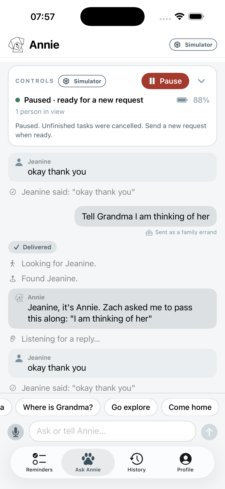

# Control and native iOS review — 2026-09-20

The iOS-to-simulator workflow is verified. This is a synthetic demo qualification,
not a physical robot or production signoff. The running stack uses the real
family API, errand service and dog runtime, a kinematic Go2 in MuJoCo, rendered
camera perception, no cloud inference, and explicitly mocked speech/listening.

## Failures found and fixed

- Typed stop used to queue behind the instruction it needed to interrupt.
  Standalone stop/pause now cancels active and queued missions immediately.
- A cancelled planner could publish into a later instruction. Results now
  belong to their original executing receipt; cancellation clears planner state.
- Patrol and return-home reported completion on acceptance. Patrol now stays
  executing for its duration; home requires measured arrival within 0.4 m or fails.
  Preparation no longer consumes the requested patrol time, and a previous
  resident hold cannot block new navigation.
- Failed speech and rejected trick acknowledgments now fail their receipts.
- The simulator starts held and remains held between explicit missions.
  Ordinary greetings/status questions do not acquire movement; negated action
  requests fail closed, and literal speech is not interpreted as a command.
- The browser previously left “planning…” displayed forever. It now follows
  the correlated receipt, preserves drafts, handles unknown outcomes, and keeps
  conversation lines visible. Stop stays in the sticky header; diagnostics fold away.
- Native testing exposed pronoun corruption: “thinking of her” became
  “thinking of your.” Attributed relay quotes now preserve the sender's words.

## Native iOS interaction, not API-only driving

On the installed iPhone 17 Pro Max simulator app, Codex tapped and typed through
the native interface:

1. Remind on “Charge your phone”: Looking for Jeanine → Delivered, with reply.
2. Go explore → Pause: active instruction became Stopped. The corresponding
   software StopMove acknowledgment took 28 ms; telemetry remained paused.
3. “Hello Annie”: the reply appeared in the native conversation, without movement.
4. A fresh family message after Pause found Jeanine and delivered successfully.
5. After fixing the wording bug, the same message was sent again from iOS and
   appeared verbatim in the spoken-message event, followed by the resident reply.

The dashboard's separate return-home check completed in 8.39 seconds at the
arrival threshold. This is one simulated route, not a general navigation guarantee.



## Repeatable checks

```sh
.venv/bin/python robot/demo_sim.py
.venv/bin/python robot/rehearse_sim.py --deliveries 5 --poll 0.25
```

Five deliveries passed with all six ordered events: navigating, arrived,
speaking, listening, heard, completed. The same rehearsal verified duplicate
submission reuse, two cancelled requests, a confirmed software stop, five
seconds without replay, and successful fresh delivery. Total: 23.957 seconds.
The [saved receipt evidence](demo/ios-control-receipts.json) includes the final
native run and the complete rehearsal summary.

The broad robot/software suite passed 774 tests with five skips; the separate
family API suite passed 108 with two skips. The 193 focused final regression checks
cover the changed runtime, routing, relay, and rehearsal behavior. Contract
exports and both frontend JavaScript syntax checks passed. One short-duration
test failed under concurrent load on its first run and passed in isolation and
the subsequent broad suite; this timing sensitivity is retained in the record.

## Remaining limits

The physical iPhone and robot were not used for this run. Real microphone,
speaker, sponsor-model inference and physical movement still require their
own E2E qualification. Free-form model conversation is disabled in this offline
stack; bounded rule-based conversation works. Native DimOS mapping/pathfinding
is not yet an integrated qualified navigation stack. The four prior fall-story
failures and restart recovery limitations in [PHONE_DELIVERY.md](PHONE_DELIVERY.md)
remain open. Mock “okay thank you” remains an unclear response, not invented
compliance with a reminder.
