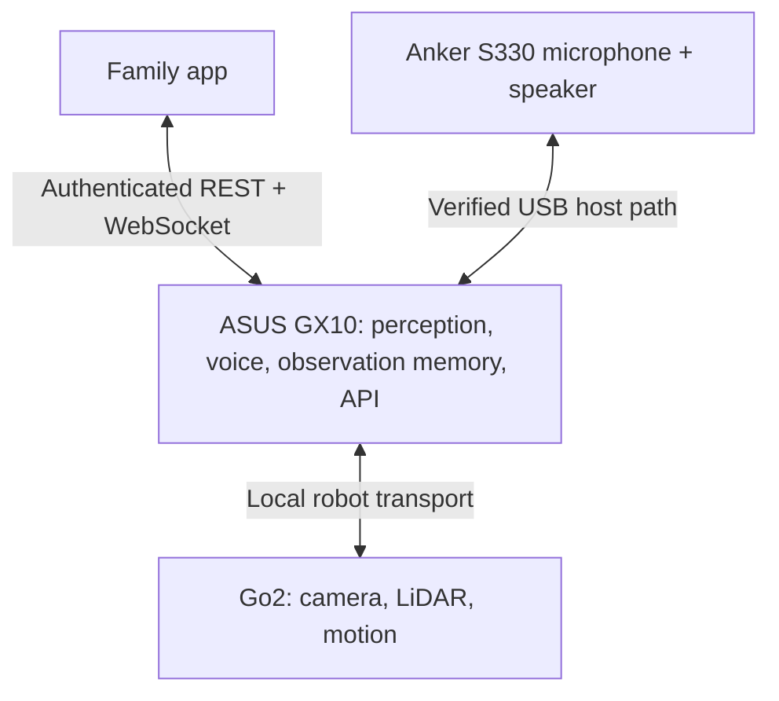

# Hardware deployment target

The owner supplied a GX10/Go2/Anker S330 architecture sketch and narrowed
HackMIT contract. Those describe deployment intent, not connected hardware.

The audio endpoint may attach through an onboard computer if that computer is
actually available and verified; a Go2 USB-host audio path is not assumed.
Robot control and raw resident frames stay on the trusted local network.
Internet-facing access requires an authenticated deployment, not exposing the
current loopback demo server directly. No public hostname is provisioned.

Current stand-ins: direct MuJoCo body, local YOLO person stop, configurable
local/cloud synthetic-image inference, local `say` playback, local Whisper,
SQLite observation memory, HTTP bridge, and family WebSocket. They preserve
component boundaries without claiming Redis, Elastic, Linq, GX10, or full
DimOS integration. No custom hardware SLAM is being written.

The supplied notes say 20 Go2s and 10 arms are available and GX10s have Nemotron
preinstalled. These are organizer/resource claims to confirm at the booth;
no device has been checked out by this software agent. Hardware acceptance
requires a real device, exact installed image-capable model, and named I/O
devices. Arms, two floors, hospital dashboards, and environmental sensors are
outside the narrowed demo scope.
