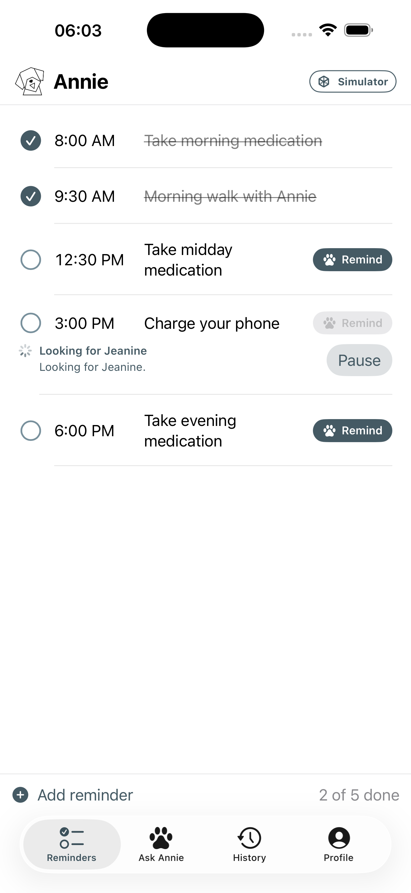
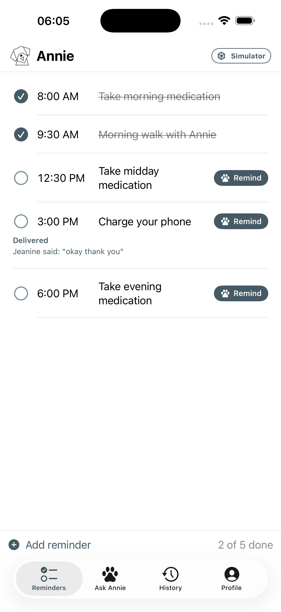

# Phone delivery and pause handoff

Updated 2026-09-20. This is the current integration handoff, not a production
signoff. The family phone, app API, errand service, and robot body are separate
connections; a successful phone request alone does not prove robot execution.

Later verification on 2026-09-20: the Mac was unlocked and the native iPhone
simulator buttons were exercised directly. Reminder delivery, exploration,
Pause, greeting/reply, and fresh delivery after Pause passed. See the
[control review and iOS evidence](CONTROL_REVIEW.md). Physical iPhone interaction
and real robot/audio qualification remain open.

## What changed

- Remind displays its run directly beneath the reminder, sends `reminder_id`,
  and prevents repeated taps while that reminder is active. The backend also
  deduplicates the same active author, text, and reminder ID.
- HTTP acceptance stays pending or queued. Execution callbacks drive the
  visible search, speech, reply, and delivered states. Missing events become a
  visible failure after a configurable inactivity deadline.
- Pause cancels unfinished family runs, cancels the active robot errand, and
  clears its FIFO. A new explicit request starts fresh. Cancellation cleanup
  cannot race a new errand; old reminders never replay after Pause.
- Stop uses a command ID and a completed firmware receipt. The app separates
  task cancellation from an unconfirmed stop. Neither HTTP acceptance nor a
  firmware acknowledgment measures the physical robot coming to rest.
- The phone distinguishes server connectivity, robot connectivity, simulator
  source, camera-only mode, and paused state. Profile always shows ElevenLabs
  and Deepgram, with configured/selected/unavailable states.
- Connected family phones refresh the shared thread and runs every two
  seconds, including reminders started by a different relative. A failed send
  preserves the typed draft for retry.
- Physical startup supports `--start-paused`: no startup stand or autonomous
  patrol. A new explicit movement command performs guarded setup. `--no-motion`
  rejects movement rather than accepting an errand it cannot execute.

## Demonstrate it

1. Start the simulator stack using [SIM_DOG.md](SIM_DOG.md). Keep its source
   label visible. Its mock audio verifies orchestration, not audible delivery.
2. Point the native iOS simulator app at that app API in Profile → Settings →
   Advanced. The simulator launcher binds the API to loopback. For an actual
   phone, run a separate family API bound to the server's reachable LAN address,
   configure its allowed hosts and family token, and use that address on the
   phone. Changing the phone URL alone does not expose a loopback-only server.
3. Tap Remind on “Charge your phone.” Confirm progress appears on the same
   screen. Tap again while active: the run ID must stay the same.
4. Press Pause during a check-in. Confirm the run becomes cancelled, the
   queue is cleared, and the stop receipt is shown separately. Wait: there
   must be no automatic replay. Send a new request to start again.
5. Let the new reminder finish. Require the run's navigation, playback,
   listening, reply, and completed events; a queued row is not success.
6. Stop the dog service and try another request. The app must explain that
   the dog is offline rather than displaying “Annie is on it.” Check Profile:
   voice providers remain visible with unavailable connection status.

The API shapes and auth requirements are in
[family_messages.md](../contract/family_messages.md). Operator body receipts
are in [body_commands.md](../contract/body_commands.md).

## Verification recorded for this change

- Device and simulator Xcode builds passed. The signed update installed on
  the physical iPhone. Launch and visual click-through were blocked by the
  phone and Mac being locked. Read-only simulator capture remained available:
  API-driven requests visibly updated the native screen; direct button clicking
  and physical iPhone launch remain unverified in this pass.
- Twelve standalone Swift checks exercise the production decoding/status
  models: pending execution, reminder ID, cancelled runs, unknown status,
  camera-only mode, simulator source, and unconfirmed stop.
- Robot errand/stop regression suite: 111 passed, using fake bodies and HTTP
  transports. Local vision adapter: seven offline tests passed. Both contract
  exports and JavaScript syntax checks passed.
- Family API suite: 108 passed, two skipped. Robot app/backend integration
  suites: 344 passed. The native production message-router harness also passed.
- Physical robot reconnected with `motion_enabled=true`, `paused=true`,
  camera processing approximately 14 fps, and battery 60% at connection.
  A correlated software stop completed in 118.9 ms end to end, including a
  14.1 ms firmware acknowledgment. No movement was requested for that probe.
  Private local evidence: `output/hardware/phone-feedback-stop.json`.
- The full physical family API → errand → body Pause path returned a confirmed
  software-stop receipt in 129.7 ms, with the dog remaining paused. Evidence:
  `output/hardware/phone-feedback-family-pause.json`.
- The live simulated errand was cancelled while running in 123.2 ms. It stayed
  cancelled until a new explicit request, which completed in 24.909 s with all
  six navigation/playback/listening/reply/completion events. The mock reply
  “okay thank you” was retained as unclear, not invented compliance.
  [Receipt summary](demo/phone-delivery-receipts.json).

The native screen during that API-driven run:

| Executing | Paused | Delivered |
| --- | --- | --- |
|  |  |  |

## Remaining production gaps

The simulation team reported 20/20 message scenarios but 16/20 fall scenarios
after the final motion guard. Failures include repeated check-ins after
reacquiring an unnamed person and one synthetic bystander contact. These are
open failures, not completed acceptance cases.

Family run progress and the errand FIFO are still in memory. A service restart
does not recover an in-flight run. The deadline makes missing progress visible;
it does not provide durable execution reconciliation. The physical WebRTC link
also dropped during an earlier stationary session. Reconnection, physical
movement/stopping qualification, native button demonstration after unlock, and
unattended operation remain separate acceptance work.
